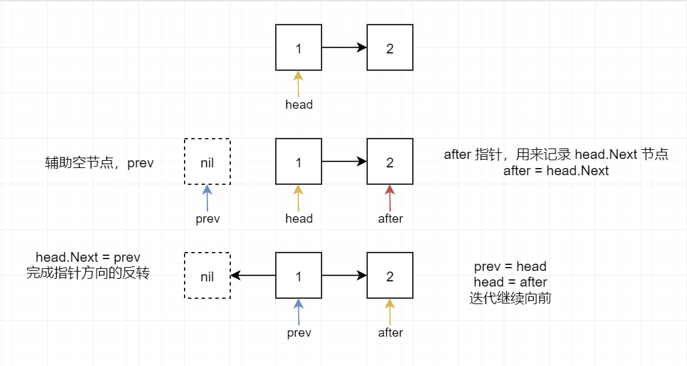
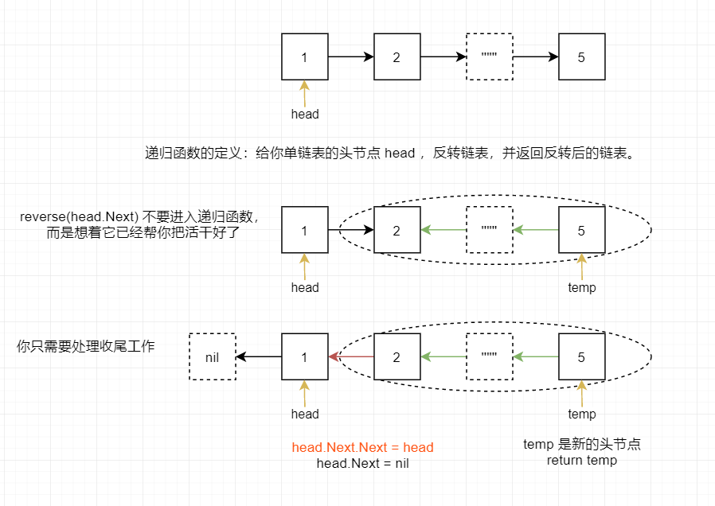

## [206. 反转链表](https://leetcode-cn.com/problems/reverse-linked-list/)

### 迭代法



核心在于辅助空节点的使用

```go
/**
 * Definition for singly-linked list.
 * type ListNode struct {
 *     Val int
 *     Next *ListNode
 * }
 */
func reverseList(head *ListNode) *ListNode {
    var prev *ListNode
    for head != nil {
        temp := head.Next
        head.Next = prev
        prev = head
        head = temp
    }
    return prev
}
```

### 递归法

递归的秘诀就是，**千万不要跳进去**，人脑不是电脑，压 3 个栈估计就懵了。

而是要根据**递归函数的定义**，认为它可以帮你处理好一切中间过程，你要做的就是收尾工作。



```go
/**
 * Definition for singly-linked list.
 * type ListNode struct {
 *     Val int
 *     Next *ListNode
 * }
 */
func reverseList(head *ListNode) *ListNode {
    if head == nil || head.Next == nil {
        return head
    }
    last := reverseList(head.Next)
    head.Next.Next = head
    head.Next = nil
    return last
}
```

### 参考

https://labuladong.gitee.io/algo/2/17/16/

